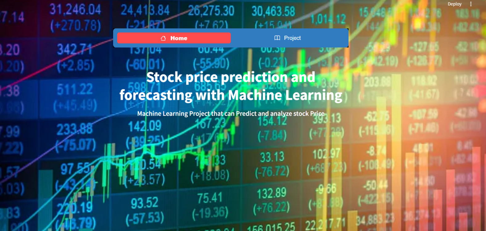
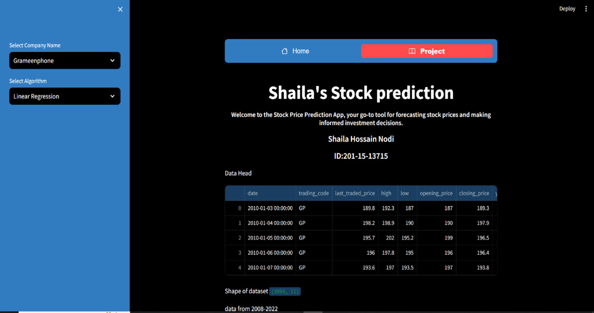
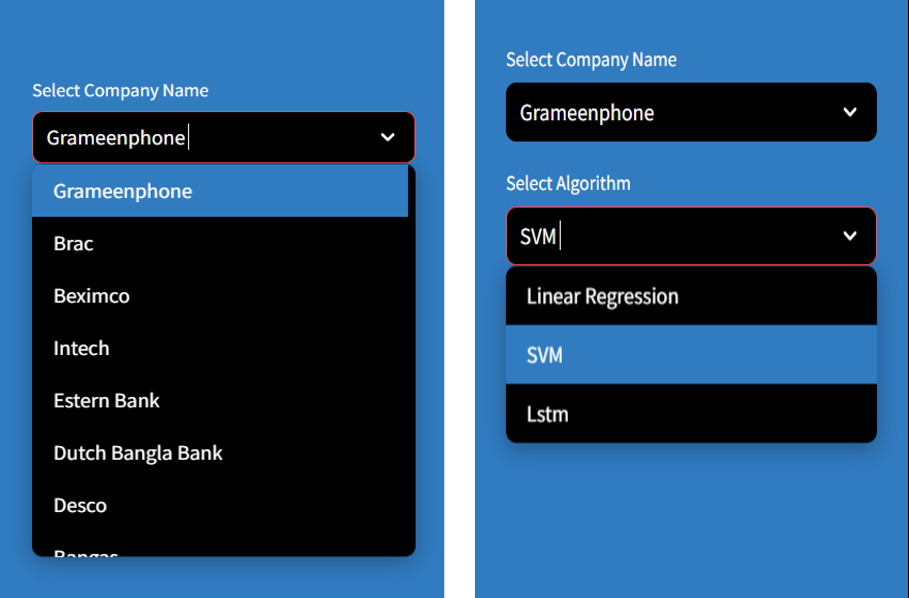
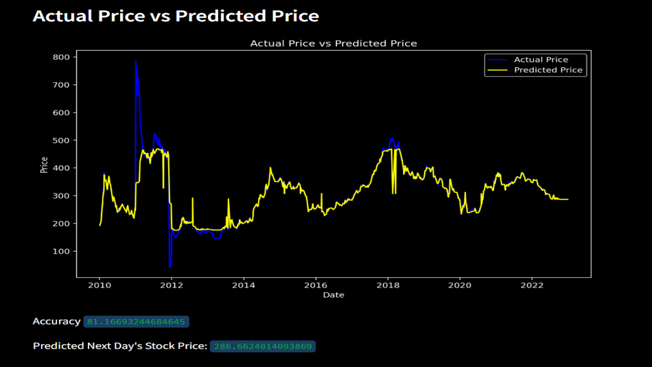

# 📈 Shaila's Stock Prediction App

**Shaila's Stock Prediction App** is a Streamlit-based application designed to help users forecast stock prices using various machine learning algorithms. This interactive tool allows users to select from different stock datasets and apply a choice of prediction models, providing insights into historical data trends and future price predictions.

---

## 📑 Table of Contents

- [Project Overview](#-shailas-stock-prediction-app)
- [Features](#-features)
- [Datasets](#-datasets)
- [Algorithms Implemented](#-algorithms-implemented)
- [Installation](#-installation)
- [Usage](#-usage)
- [Results & Performance](#-results--performance)
---
## Homepage

## Project UI

## Project UI

## Output

## Features

- **Dataset Selection**  
  Choose between:
  - Grameenphone  
  - Brac Bank  
  - Beximco  

- **Algorithm Selection**  
  Select from three machine learning models:
  - Linear Regression  
  - Support Vector Machine (SVM)  
  - Long Short-Term Memory (LSTM) Neural Network  

- **Data Visualization**  
  View historical opening and closing prices with interactive charts.

- **Prediction Visualization**  
  Compare actual vs. predicted stock prices in dynamic plots.

- **Accuracy Metrics**  
  See model accuracy using:
  - R-squared (for LR and SVM)
  - 100 - MAPE (for LSTM)

- **Next Day Prediction**  
  Get predicted price for the very next trading day.

---

## Datasets

The application uses historical stock data in `.xlsx` format. Files should be placed in:
Available datasets:

- `Grameenphone.xlsx`
- `Brac bank.xlsx`
- `Beximco.xlsx`

Each dataset must include these columns:  
`date`, `opening_price`, `high`, `low`, `closing_price`.

---

## Algorithms Implemented

### Linear Regression

- Predicts closing price using opening, high, and low prices.
- **Data Split**: 80% training / 20% testing (`random_state=0`)
- **Accuracy**: R-squared score
- **Prediction**: Uses last 30 days of features

### Support Vector Machine (SVM)

- Uses SVR to model relationships in stock features.
- **Data Split**: 80/20, same as LR
- **Accuracy**: R-squared score
- **Prediction**: Based on recent 30 days' data

### Long Short-Term Memory (LSTM)

- Neural network specialized for time series prediction.
- **Preprocessing**:
  - Scaled with `MinMaxScaler`
  - Sequences of 60 days created
- **Architecture**:
  - 2 LSTM layers (50 units each)
  - 2 Dense layers (25 units, then 1 output)
- **Training**:
  - Optimizer: `adam`
  - Loss: `mean_squared_error`
  - Epochs: 10, Batch size: 64
- **Accuracy**: `100 - MAPE` (Mean Absolute Percentage Error)

### Interact with the App
  - Choose a stock dataset
  - Select a prediction model
  - View visualizations, metrics, and predicted next-day prices

